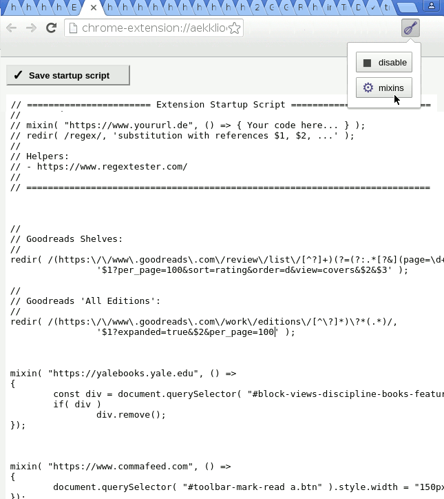

# Tiny Javascript Injector for Google Chrome

**Customize a remote website when it doesn't offer a native setting and developers are busy.**

There are prettier code injection extensions, e.g.,
Dmitry Novikov's ["User Javascript and CSS"](https://chrome.google.com/webstore/detail/user-javascript-and-css/nbhcbdghjpllgmfilhnhkllmkecfmpld?hl=en-US).
However, you give "sqdevil@yandex.ru", "junkycoder" etc. full control over everything you read on the web.
You could also try userscript managers such as [Violentmonkey](https://violentmonkey.github.io/) or [Tampermonkey](https://tampermonkey.net/), with scripts from [Greasyfork](https://greasyfork.org/) or [OpenUserJS](https://openuserjs.org/).

Chrome _content scripts_ can modify websites, e.g. [political](https://chrome.google.com/webstore/search/politics%20OR%20political%20OR%20activist%20OR%20activisim?hl=en&_category=extensions) content, and [exfiltrate](https://www.theregister.co.uk/2018/07/05/browsers_pull_stylish_but_invasive_browser_extension/) 
private information. So I made my own extension, which is small and easy to inspect if you consider using it.

This extension also helps replace smaller Chrome extensions such as 
Rubén Martínez's ["Goodreads Ratings for Amazon"](https://chrome.google.com/webstore/detail/goodreads-ratings-for-ama/fkkcefhhadenobhjnngfdahhlodolkjg)
by adding [an equivalent function](https://gist.github.com/andre-st/592825fe9a5b2eafc5a73feb80ade649) to the mixins script.
The fewer strangers fiddling with my browser, the better.

## Program Features and Screenshots

- supports **URL redirections** (replaces Einar Egilsson's [Redirector](https://chrome.google.com/webstore/detail/redirector/ocgpenflpmgnfapjedencafcfakcekcd)
  extension)
- no automatic updates (unlike [this](https://www.theregister.co.uk/2018/07/05/browsers_pull_stylish_but_invasive_browser_extension/) 
  or [this adware buy-out](https://www.bleepingcomputer.com/news/security/-particle-chrome-extension-sold-to-new-dev-who-immediately-turns-it-into-adware/)), 
  see Installation section
- tiny, kept to the bare minimum = little maintenance
- easy to inspect if you consider using it -- no 3rd party libs, nothing [minified](https://en.wikipedia.org/wiki/Minification_(programming)), small files
- apart from tabs for indentation and simple autocompletion via <kbd>Ctrl</kbd>+<kbd>Space</kbd>, it lacks any comfort and visual beauty: no syntax highlighting or validation (no Ace editor, jslint, ...); the browser console, however, proved sufficient for debugging
- inject CSS or Javascript, for example:
	- [Force consistent Goodreads.com view settings](https://gist.github.com/andre-st/71c824fd1e8b61e6e29af2a962c60956)
	- [Show Goodreads.com ratings on Amazon](https://gist.github.com/andre-st/592825fe9a5b2eafc5a73feb80ade649)
	- [Price-filter for Amazon wishlists](https://gist.github.com/andre-st/ae556e9966738a5b3d7d2ff773196207)
	- Bypass paywall of your local newspaper
	- [more scripts](https://gist.github.com/search?q=user%3Aandre-st+%23injectjs)
- flexible and easy to extend due to its script-based configuration (rather than having a complex UI that tries to be as flexible as a programming language just use a programming language); you can add comments everywhere, too

  
  
- your mixin scripts run in the [context of the target website](https://developer.chrome.com/extensions/content_scripts#isolated_world)
  - so you can not just access its DOM, but its Javascript variables and functions too
  - the targeted website cannot easily hijack your extension
  - everything outside mixin() runs in the context of the extension, with other privileges
- export/import = copy/paste the content of the text area

## Installation

1. not available in Chrome's Web Store
2. you cannot easily install CRX-files permanently from other sites
3. clone Git repository or [save as Zip-file](https://github.com/andre-st/chrome-injectjs/archive/master.zip)
4. Chrome > Settings > Extensions > [x] Developer mode (upper right corner)
5. Chrome > Settings > Extensions > click <kbd>Load unpacked extension</kbd> 
6. browse to the source directory of the downloaded, unarchived release and confirm

## Feedback

Use [GitHub](https://github.com/andre-st/chrome-injectjs/issues) or see [AUTHORS.md](AUTHORS.md) file
