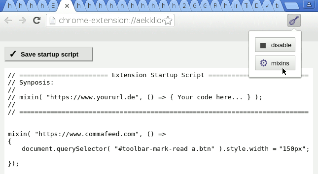

# Tiny Javascript Injector for Google Chrome

Customize a remote website when there is no native setting.

There are other and better code injection extensions, e.g.,
[Dmitry Novikov's "User Javascript and CSS"](https://chrome.google.com/webstore/detail/user-javascript-and-css/nbhcbdghjpllgmfilhnhkllmkecfmpld?hl=en-US).
However, you give "sqdevil@yandex.ru", "junkycoder" etc. full control over everything you read on the web. 
Chrome [content scripts](https://developer.chrome.com/extensions/content_scripts#isolated_world) can modify websites, e.g. [political](https://chrome.google.com/webstore/search/politics%20OR%20political%20OR%20activist%20OR%20activisim?hl=en&_category=extensions) content and exfiltrate private information. So I made my own extension—better paranoid than sorry.

## Program Features and Screenshots

- tiny, kept to the bare minimum
- easy to inspect if you consider using it—no 3rd party libs, nothing [minified](https://en.wikipedia.org/wiki/Minification_(programming)), small files
- it lacks any comfort and visual beauty: no syntax highlighting or validation (no Ace editor, jslint, ...)
- flexible and easy to extend due to its script-based configuration

  
  
- no automatic updates, see Installation section
- in order to import/export settings you just copy/paste the content of the text area

## Installation

1. not available in Chrome's Web Store
2. you cannot easily install CRX-files permanently from other sites
3. clone Git repository
4. Chrome > Settings > Extensions > [x] Developer mode (upper right corner)
5. Chrome > Settings > Extensions > click <kbd>Load unpacked extension</kbd> 
6. browse to the source directory of the downloaded, unarchived release and confirm

## Feedback

Use [GitHub](https://github.com/andre-st/chrome-inject/issues) or see [AUTHORS.md](AUTHORS.md) file

## License

Creative Commons BY-SA

